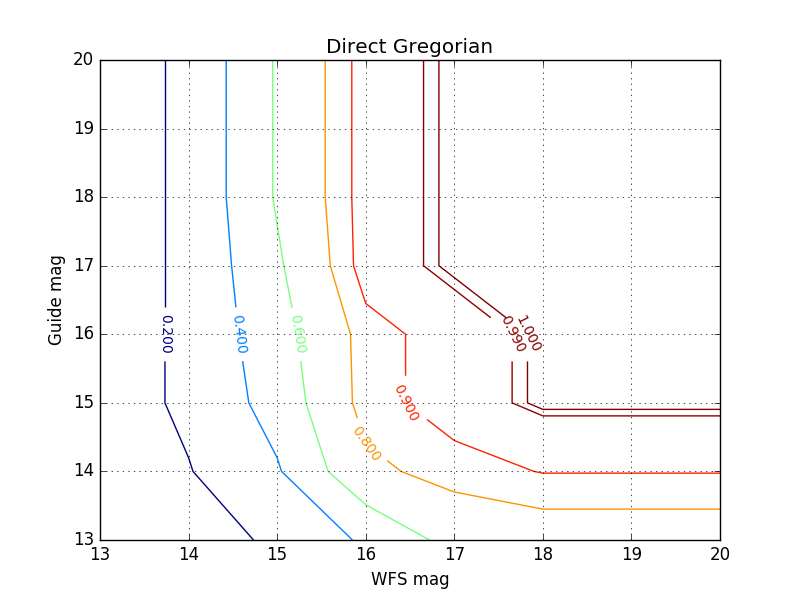

## General

This code is for simulating the probe arms over the primary mirrors of
the [GMT](http://www.gmto.org/), and determining the probability of
finding sufficiently bright stars for the active optics system.

## Running

I initially wrote this program on OS X 10.11.4 (El Capitan). This is
what I get when I run `g++ --version`.

    Configured with:
    --prefix=/Applications/Xcode.app/Contents/Developer/usr
    --with-gxx-include-dir=/usr/include/c++/4.2.1
    Apple LLVM version 6.1.0 (clang-602.0.53) (based on LLVM 3.6.0svn)
    Target: x86_64-apple-darwin15.4.0
    Thread model: posix

I have also successfully compiled and run the program on Ubuntu 14.04
64-bit.

To build the project, run `make` in the project directory. This will
compile an executable named <b>skycov</b>. Type `./skycov` to run.

The program will read in star field data from star catalogues in Bes2,
and compute the probabilities of finding guide star/wave front star
combinations where the positions of the probes are such that there are
no collisions. There must be three wave front stars of the same
magnitude for the combination to be valid.

Output looks something like this:

    grid    config    wfsmag    gdrmag    prob
    ----    ------    ------    ------    ----
    grid    dgnf      13        14        0.0952381
    grid    dgnf      13        15        0.0952381
    grid    dgnf      13        16        0.0952381
    grid    dgnf      13        17        0.0952381
    grid    dgnf      13        18        0.0952381
    grid    dgnf      13        19        0.0952381
    grid    dgnf      14        13        0.0952381
    grid    dgnf      14        14        0.190476
    grid    dgnf      14        15        0.238095
    grid    dgnf      14        16        0.238095
    grid    dgnf      14        17        0.238095
    grid    dgnf      14        18        0.238095
    grid    dgnf      14        19        0.238095
    grid    dgnf      15        13        0.238095
    grid    dgnf      15        14        0.380952
    grid    dgnf      15        15        0.47619
    grid    dgnf      15        16        0.52381
    grid    dgnf      15        17        0.571429
    grid    dgnf      15        18        0.619048
    grid    dgnf      15        19        0.619048
    grid    dgnf      16        13        0.428571
    grid    dgnf      16        14        0.761905
    grid    dgnf      16        15        0.857143
    grid    dgnf      16        16        0.857143
    grid    dgnf      16        17        0.952381
    grid    dgnf      16        18        0.952381
    grid    dgnf      16        19        0.952381
    grid    dgnf      17        13        0.666667
    grid    dgnf      17        14        0.857143
    grid    dgnf      17        15        0.952381
    grid    dgnf      17        16        0.952381
    grid    dgnf      17        17        1
    grid    dgnf      17        18        1
    grid    dgnf      17        19        1
    grid    dgnf      18        13        0.714286
    grid    dgnf      18        14        0.904762
    grid    dgnf      18        15        1
    grid    dgnf      18        16        1
    grid    dgnf      18        17        1
    grid    dgnf      18        18        1
    grid    dgnf      18        19        1
    grid    dgnf      19        13        0.714286
    grid    dgnf      19        14        0.904762
    grid    dgnf      19        15        1
    grid    dgnf      19        16        1
    grid    dgnf      19        17        1
    grid    dgnf      19        18        1
    grid    dgnf      19        19        1

The output can be plotted with the python script in plotgrid.py. In
order to do so, pipe the output of the program to a file.

    ./skycov > dogrid.results.4probe

Then run the plotting script on the file

    python plotgrid.py dogrid.results.4probe

The plotting script writes a file called maglim.bare.dgnf.png. The
result of plotting the above output looks like this:

## Future Improvements

Some things are currently hardcoded into the program that shouldn't
be.

The first is the geometry of the probes. Since the design of the
probes is still changing week to week, it will be beneficial to be
able to specify a text file from which to read probe geometries. This
will be included in the next version of the program.

Another hardcoded piece is the output of the program. Usually it is
useful to simply output the probabilities in the format given above.
But when testing the correctness of the program, it can be helpful to
output the coordinates of the probes as they are moved into different
configurations. This should be a pretty simple flag to pass in that
will determine the output, and will likely be included in the next
version of the program.
